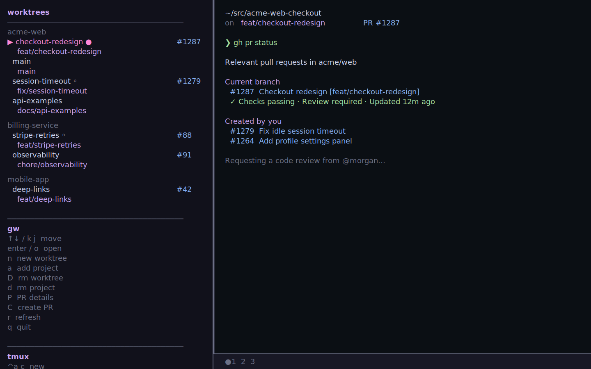
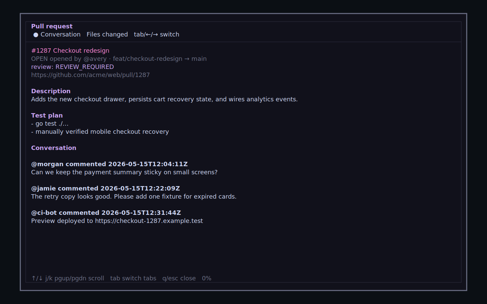
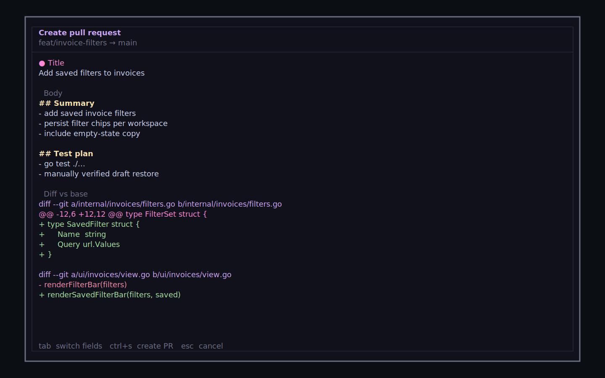

# gw

A terminal-based git worktree manager that runs inside tmux. Navigate between worktrees from a persistent sidebar — each worktree keeps its own live shell, editor session, and running processes while it's in the background.

`gw` now also integrates with GitHub pull requests through the GitHub CLI: branches show their open PR number, existing PRs can be inspected in a popup, and new PRs can be drafted and created from inside the sidebar.



## Requirements

- Go 1.24+
- tmux
- git
- GitHub CLI (`gh`) — required for PR badges, PR details, and PR creation

## Installation

```
go install github.com/redrick/gw@latest
```

Or clone and build:

```
git clone https://github.com/redrick/gw
cd gw
make install
```

## Usage

Run `gw` from any directory. If you're inside a git repo it's automatically tracked.

```
gw
```

gw opens a tmux session with a 40-column sidebar on the left and the active worktree's shell on the right. Switching worktrees is server-side (tmux `swap-pane`) — no keystroke injection, so running processes are never interrupted.

With `gh` installed and authenticated, gw checks GitHub for open pull requests on each branch and shows the PR number beside the branch name.

If you re-run `gw` while a session is already open, it re-attaches to it.

## Keys

### Sidebar

| Key | Action |
|-----|--------|
| `↑↓` / `k j` | move cursor |
| `enter` / `o` | open worktree |
| `n` | create new worktree |
| `a` | add existing repo to tracking |
| `D` | remove worktree (with confirmation) |
| `d` | remove project from tracking |
| `P` | open PR details for the current branch |
| `C` | create a PR for the current branch |
| `r` | refresh worktree list |
| `q` | quit and kill session |

### tmux (prefix `^a`)

| Key | Action |
|-----|--------|
| `^a c` | new shell tab |
| `^a n` | next tab |
| `^a p` | previous tab |
| `^a s` | focus sidebar |
| `^a [` | scroll mode |

Each worktree supports multiple shell tabs (`^a c`). The active tab is shown in the status bar at the bottom of the right pane.

## Pull requests

PR support depends on the GitHub CLI (`gh`). Install it, authenticate with `gh auth login`, and make sure the branch has a GitHub remote.

### PR details

Branches with an open PR show the PR number in the sidebar. Select that branch and press `P` to open a tmux popup with the PR overview, comments, and diff.



### Create a PR

Select a pushed branch with no existing PR and press `C`. gw opens a PR creation popup, drafts a title and description from the branch commits, previews the diff, and creates the PR via `gh pr create` when you press `ctrl+s`.

The branch must have an upstream, be fully pushed, and target a GitHub repository.



## State

Tracked projects and session state are persisted in `~/.config/gw/state.json`.

## License

MIT
