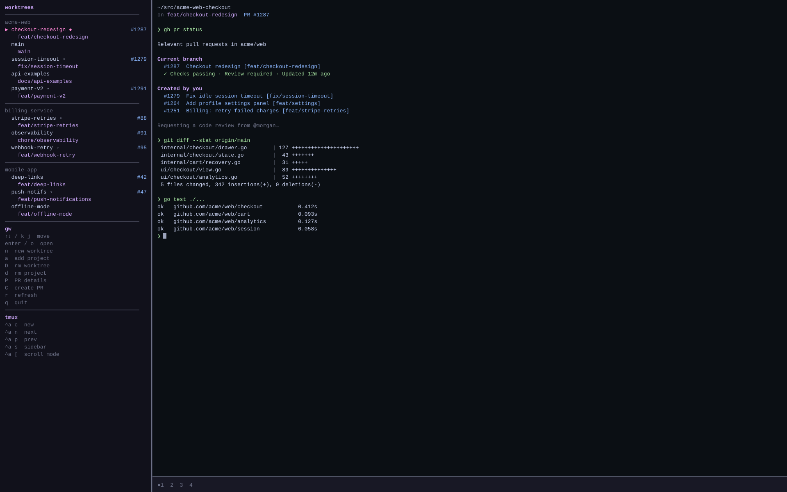
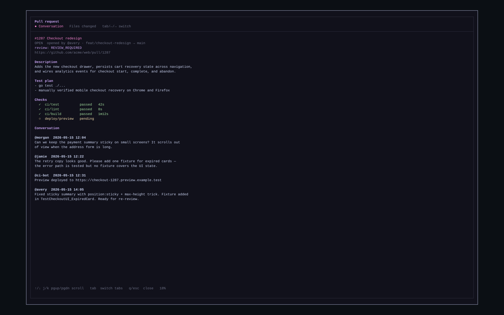
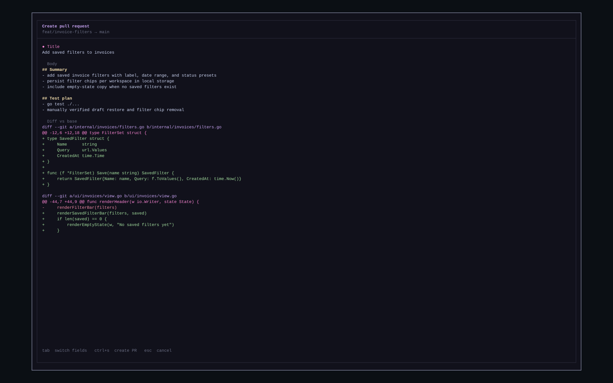

# gw

A terminal-based git worktree manager that runs inside tmux. Navigate between worktrees from a persistent sidebar — each worktree keeps its own live shell, editor session, and running processes while it's in the background.

`gw` now also integrates with GitHub pull requests through the GitHub CLI: branches show their open PR number, existing PRs can be inspected in a popup, and new PRs can be drafted and created from inside the sidebar.



## Requirements

- Go 1.24+
- tmux
- git
- GitHub CLI (`gh`) — required for PR badges, PR details, and PR creation

Optional, for desktop notifications when a background worktree needs input (see [Notifications](#notifications)):

- `notify-send` (libnotify) — required to show notifications at all
- `gdbus` (glib2) — lets gw auto-dismiss a notification after a timeout
- `wmctrl` or `xdotool` (X11) — lets a clicked notification raise the terminal

## Installation

```
go install github.com/redrick/gw@latest
```

Or clone and build:

```
git clone https://github.com/redrick/gw
cd gw
make install
```

## Usage

Run `gw` from any directory. If you're inside a git repo it's automatically tracked.

```
gw
```

gw opens a tmux session with a 40-column sidebar on the left and the active worktree's shell on the right. Switching worktrees is server-side (tmux `swap-pane`) — no keystroke injection, so running processes are never interrupted.

With `gh` installed and authenticated, gw checks GitHub for open pull requests on each branch and shows the PR number beside the branch name.

If you re-run `gw` while a session is already open, it re-attaches to it.

## Keys

### Sidebar

| Key | Action |
|-----|--------|
| `↑↓` / `k j` | move cursor |
| `enter` / `o` | open worktree |
| `n` | create new worktree |
| `a` | add existing repo to tracking |
| `D` | remove worktree (with confirmation) |
| `d` | remove project from tracking |
| `P` | open PR details for the current branch |
| `C` | create a PR for the current branch |
| `/` | search worktrees |
| `↑↓` (in search) | cycle matches |
| `r` | refresh worktree list |
| `q` | quit and kill session |

### tmux (prefix `^a`)

| Key | Action |
|-----|--------|
| `^a c` | new shell tab |
| `^a n` | next tab |
| `^a p` | previous tab |
| `^a s` | focus sidebar |
| `^a [` | scroll mode |

Each worktree supports multiple shell tabs (`^a c`). The active tab is shown in the status bar at the bottom of the right pane.

## Notifications

Background agents (Claude, Codex, and similar tools) often pause to ask for permission — to run a command, make an edit, and so on. When that happens in a worktree you're not currently looking at, it's easy to miss. gw watches every worktree's pane for these permission prompts and surfaces them two ways:

- **In the sidebar** — the worktree's status indicator turns orange `⚠ input` while an agent is waiting.
- **As a desktop notification** — on the rising edge (a prompt that wasn't there before), gw fires a `notify-send` notification titled `⚠ worktree needs input` naming the project/branch. It notifies even for the foreground worktree, in case you've switched to another window.

The notification uses critical urgency so it stays on screen. Clicking it brings the gw session to the worktree that needs attention and raises the terminal window (via `wmctrl`/`xdotool`). If left untouched it auto-dismisses after a timeout (via `gdbus`). Each worktree fires at most one notification per prompt.

If `notify-send` isn't installed the sidebar indicator still works; only the desktop popups are skipped.

> **Platform support:** desktop notifications target Linux with a freedesktop notification daemon. The click-to-raise-terminal step is **X11 only** — it's gated on `DISPLAY` and uses `wmctrl`/`xdotool`, neither of which works under Wayland (notifications still show and auto-dismiss there, the terminal just won't be raised on click). macOS and Windows are unsupported; the sidebar `⚠ input` indicator works everywhere.

### Configuration

Tune behaviour with environment variables (set them before launching `gw`):

| Variable | Default | Meaning |
|----------|---------|---------|
| `GW_ATTN_PATTERNS` | built-in list | `\|`-separated, case-insensitive substrings that mark a pane as "waiting for input". Overrides the defaults entirely. |
| `GW_NOTIFY_TIMEOUT` | `35` | Seconds before an unactioned notification is auto-closed. |

The default patterns match common Claude/Codex permission prompts (`do you want to proceed`, `do you want to run`, `allow command`, `1. yes`, …). Override `GW_ATTN_PATTERNS` if your agent uses different wording.

## Pull requests

PR support depends on the GitHub CLI (`gh`). Install it, authenticate with `gh auth login`, and make sure the branch has a GitHub remote.

### PR details

Branches with an open PR show the PR number in the sidebar. Select that branch and press `P` to open a tmux popup with the PR overview, comments, and diff.

Inside PR details, use `tab`/arrow keys to switch between the conversation and files changed views. In the conversation view, use `n`/`p` to select the description or a comment, `e` to edit the selected text, `c` to add a new comment, and `ctrl+s` to save changes via GitHub.



### Create a PR

Select a pushed branch with no existing PR and press `C`. gw opens a PR creation popup, drafts a title and description from the branch commits, previews the diff, and creates the PR via `gh pr create` when you press `ctrl+s`.

The branch must have an upstream, be fully pushed, and target a GitHub repository.



## State

Tracked projects and session state are persisted in `~/.config/gw/state.json`.

## License

MIT
